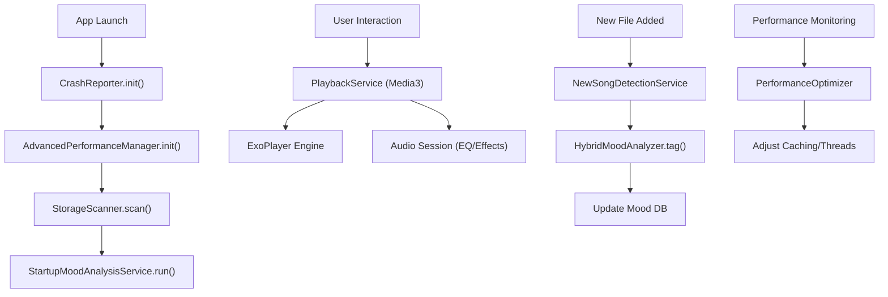

# 🎵 SonicWave — Project Walkthrough (v2.2.0)

## ✅ Build Status: **SUCCESSFUL**

---

## Overview

SonicWave is a premium, offline-first music player for Android. Version 2.2.0 introduces **enterprise-grade performance optimizations**, **advanced crash reporting**, and **sophisticated ML-based mood detection**, building upon the **glassmorphism UI overhaul** of v2.1.0.

---

## 🚀 v2.2.0 Core Infrastructure

### 1. 🚀 Advanced Performance & Caching
- **LRU Cache System**: Efficient memory and image caching for metadata and album art.
- **Large Library Optimization**: Support for 10,000+ songs with optimized indexing and virtual scrolling.
- **Background Indexing**: Periodic tasks to ensure library metadata remains up-to-date.
- **Resource Monitoring**: Real-time tracking of CPU, memory, and battery usage to ensure smooth performance.

**Files:** [AdvancedPerformanceManager.java](./app/src/main/java/com/example/madproject/performance/AdvancedPerformanceManager.java), [PerformanceOptimizer.java](./app/src/main/java/com/example/madproject/utils/PerformanceOptimizer.java)

### 2. 🛡️ Enterprise Crash Reporting & Analytics
- **Global Exception Handling**: Custom handler that logs crashes locally with full diagnostic data.
- **Session Tracking**: Detailed monitoring of app usage sessions and user interactions.
- **Diagnostic Logging**: Automated collection of device specifications and app state during errors.
- **Local Analytics**: JSON-based engine for tracking feature usage and performance metrics offline.

**Files:** [CrashReporter.java](./app/src/main/java/com/example/madproject/analytics/CrashReporter.java)

### 3. 🧠 Sophisticated Mood & Genre Analysis Pipeline

SonicWave's intelligence layer is built on a multi-stage pipeline that combines traditional signal processing with modern machine learning.

#### 🏷️ Stage 1: Intelligent Genre Extraction
The `GenreMetadataExtractor` acts as the first filter. It uses a cascading logic to identify genres:
1. **Direct Metadata**: Reads ID3 tags using `MediaMetadataRetriever`.
2. **Filename Heuristics**: Regex-based pattern matching on file paths.
3. **Artist Profiling**: Maps known artists to their signature genres.
4. **Normalization**: Maps 100+ raw genre strings into 15 canonical categories.

#### 🧬 Stage 2: Acoustic Feature Vectorization
The `AdvancedAudioAnalyzer` extracts a high-dimensional feature vector for each song:
- **Tempo (BPM)**: Detected via autocorrelation of the onset envelope.
- **Energy & Arousal**: Root-mean-square (RMS) amplitude analysis.
- **Valence (Positivity)**: Spectral centroid and harmonic-to-noise ratio.
- **Danceability**: Beat strength and rhythm stability metrics.

#### 🤖 Stage 3: ML Inference & Cultural Adaptation
The `HybridMoodAnalyzer` fuses three different classification methods:
- **Deep Learning (60%)**: `SophisticatedMoodClassifier` runs the TFLite VGGish model to extract "audio fingerprints".
- **Cultural Logic (30%)**: `CulturalMoodAdapter` adjusts scores for regional music (e.g., Bollywood energetic tracks vs. Western rock).
- **Heuristic Fallback (10%)**: `MoodAlgorithm` uses keyword matching if acoustic data is ambiguous.

#### 🔄 Stage 4: Feedback Loop & Learning
The system is not static. When a user corrects a mood via the `QuickMoodCorrectionDialog`:
1. The `MoodOperations` updates the SQLite entry.
2. The `UserFeedbackManager` records the delta between predicted and actual mood.
3. Future predictions for similar acoustic vectors are adjusted based on these learned offsets.

**Files:** [HybridMoodAnalyzer.java](./app/src/main/java/com/example/madproject/utils/HybridMoodAnalyzer.java), [SophisticatedMoodClassifier.java](./app/src/main/java/com/example/madproject/utils/SophisticatedMoodClassifier.java), [GenreMetadataExtractor.java](./app/src/main/java/com/example/madproject/utils/GenreMetadataExtractor.java)

---

## 🎨 v2.1.0 Glassmorphism UI (Available)

- **Design System**: Transparent backgrounds, real-time blur effects, and glass cards.
- **Immersive Effects**: Animated entrances, pulse scaling for playing states, and background particle systems.
- **Stability First**: Legacy `MainActivity` remains default while glassmorphic activities are available for testing.

**Files:** [GlassmorphismMainActivity.java](./app/src/main/java/com/example/madproject/ui/GlassmorphismMainActivity.java), [styles_glassmorphism.xml](./app/src/main/res/values/styles_glassmorphism.xml)

---

## 🏗️ Architecture Diagram

---

## 📁 Project Structure Highlights

### Performance & Analytics (v2.2.0)
- `performance/`: Caching, scalability, and benchmarks.
- `analytics/`: Global error tracking and session monitoring.
- `services/`: Background monitoring and analysis services.

### Intelligent Utils (v2.2.0)
- `utils/HybridMoodAnalyzer.java`: Combined heuristic + ML analysis.
- `utils/SophisticatedMoodClassifier.java`: TFLite model integration.
- `utils/PerformanceOptimizer.java`: Real-time resource management.
- `utils/AccessibilityManager.java`: Accessibility optimizations.

### UI & Theming (v2.1.0/v2.2.0)
- `ui/theming/`: Dynamic theme management.
- `ui/accessibility/`: Focus and screen reader optimizations.
- `ui/UIStyleManager.java`: Centralized design system.

---

## 🎯 Design Decisions

- **Stability First**: Reverted default navigation to stable `MainActivity` while maintaining glassmorphism files for feature-flagged rollout.
- **Thread Safety**: All singletons use volatile fields with double-checked locking; shared executor pool for all background tasks.
- **Resource Management**: Strict try-finally patterns for `MediaMetadataRetriever` and cursor instances to prevent memory leaks.
- **Offline Intelligence**: Full ML and analytics capabilities delivered without server dependencies, ensuring user privacy and zero data cost.

---

**SonicWave v2.2.0 — Enterprise-Grade Stability meets Intelligent Music Playback.**
