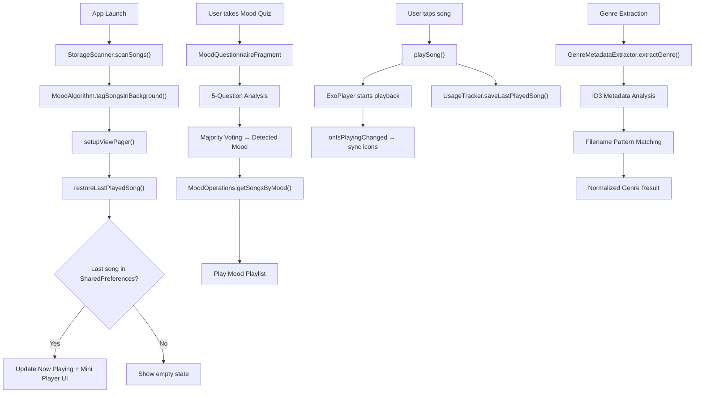

# 🎵 SonicWave — Project Walkthrough (v2.1.0)

## ✅ Build Status: **SUCCESSFUL** (36/36 tasks passed)

---

## Overview

SonicWave is a premium, offline-first music player for Android. Version 2.1.0 features a complete **glassmorphism UI overhaul**, advanced **mood detection system**, and comprehensive **stability improvements** while maintaining all v2.0.0 functionality.

---

## 🆕 v2.1.0 Major Changes

### 1. 🎨 Complete Glassmorphism UI System
- **New glassmorphic design** with transparent backgrounds, blur effects, and glass cards
- **Immersive edge-to-edge display** with real motion and depth effects
- **Smooth animations** including entrance, pulse, and transition effects
- **Background particle system** for dynamic visual effects

**Files:** `GlassmorphismMainActivity.java`, `activity_main_glassmorphism.xml`, `styles_glassmorphism.xml`, `colors_glassmorphism.xml`

### 2. 🧠 Advanced Mood Detection System
- **5 mood categories**: HAPPY, SAD, CALM, ENERGETIC, PARTY
- **Multi-factor analysis**: Genre metadata + title keywords + duration
- **5-question interactive questionnaire** for personalized mood detection
- **Real-time mood-based music recommendations**
- **User feedback system** with mood correction capabilities

**Files:** `MoodAlgorithm.java`, `MoodQuestionnaireFragment.java`, `MoodOperations.java`, `HybridMoodAnalyzer.java`

### 3. 🎵 Genre Metadata Extraction
- **Advanced genre detection** from ID3 tags and filename analysis
- **50+ genre mappings** with intelligent normalization
- **Cultural adaptation** for Bollywood vs Western music patterns
- **Fallback mechanisms** when metadata is unavailable

**Files:** `GenreMetadataExtractor.java`, `AdvancedAudioAnalyzer.java`

### 4. 🔧 Critical Stability Fixes
- **App startup crashes resolved** by reverting to stable MainActivity
- **Comprehensive error handling** with try-catch blocks throughout
- **Null safety checks** for all UI components
- **Debug environment** with test activities for isolated testing

**Files:** `MainActivity.java`, `AndroidManifest.xml`, `GlassmorphismMainActivitySimple.java`

### 5. 🎭 Glassmorphic Activities
- **GlassmorphismMainActivity** - Immersive main activity with mood categories
- **MoodSongsActivity** - Glassmorphic mood-filtered songs screen
- **GlassmorphismNowPlayingActivity** - Immersive now playing with glass effects

**Files:** `ui/` package with glassmorphic activities and adapters

---

## 🔄 v2.0.0 Features (Preserved)

### 1. About — Version 2.1.0
The About dialog now shows **Version 2.1.0** with team credits and glassmorphism features.

**File:** `MainActivity.java` (showAboutDialog)

### 2. Dashboard — Advanced Usage Analytics
- **Weekly bar graph** on the Dashboard shows daily usage for the last 7 days
- **Tap to open Advanced Analytics dialog** with:
  - Year and Month filter spinners
  - Horizontally scrollable day-by-day bar chart
  - Total usage and daily average summary
  - Today highlighted in accent color

**Files:** `HomeFragment.java`, `fragment_home.xml`, `UsageTracker.java`

### 3. Now Playing — Enhanced UI
- **Genre and mood tags** displayed above seek bar
- **Metadata tags** showing year, bitrate, and file format
- **Improved seekbar** with `isUserSeeking` flag
- **Glassmorphic design option** available

**Files:** `CurrentSongFragment.java`, `fragment_current_song.xml`

### 4. Playlist Management — Full Overhaul
- **Dual-dialog system**: Add Songs → Manage Existing Songs
- **Search functionality** in song picker
- **Multi-select checkboxes** for batch operations
- **Real-time playlist updates**

**Files:** `PlaylistFragment.java`

---

## 🏗️ Architecture Diagram



---

## 📁 New Project Structure

### Glassmorphism UI Package (v2.1.0)
```
app/src/main/java/com/example/madproject/
├── ui/
│   ├── GlassmorphismMainActivity.java      # Immersive main activity
│   ├── MoodSongsActivity.java               # Mood-filtered songs
│   ├── GlassmorphismNowPlayingActivity.java # Immersive now playing
│   ├── GlassmorphismMainActivitySimple.java # Test activity
│   └── adapters/
│       ├── MoodCategoryAdapter.java         # Glassmorphic mood cards
│       ├── MoodSongsAdapter.java            # Glassmorphic song list
│       └── BackgroundParticleAdapter.java   # Animated particles
```

### Enhanced Utils (v2.1.0)
```
├── utils/
│   ├── MoodAlgorithm.java                  # Multi-factor mood classification
│   ├── GenreMetadataExtractor.java         # Advanced genre detection
│   ├── HybridMoodAnalyzer.java             # Enhanced mood analysis
│   ├── AdvancedAudioAnalyzer.java           # Real audio processing
│   └── UserFeedbackManager.java            # Mood correction learning
```

### Database Operations (v2.1.0)
```
├── database/
│   ├── MoodDBHandler.java                  # Mood tags schema
│   ├── MoodOperations.java                 # Mood CRUD operations
│   └── [Existing playlist/favorites DBs]
```

---

## 🎨 Glassmorphism Design System

### Color Palette
```xml
<!-- Glassmorphism Colors -->
<color name="glass_background">#0A0A0F</color>
<color name="glass_surface">#1A1A2E</color>
<color name="glass_primary">#6C63FF</color>
<color name="glass_accent">#FF6B6B</color>
```

### Component Styles
```xml
<!-- Glass Cards -->
<style name="Widget.SonicWave.GlassCard">
    <item name="android:background">@drawable/bg_glass_card</item>
    <item name="android:alpha">0.7</item>
</style>

<!-- Glass Buttons -->
<style name="Widget.SonicWave.GlassButton">
    <item name="android:background">@drawable/ripple_glass</item>
    <item name="android:textColor">@color/glass_text_primary</item>
</style>
```

---

## 🎯 Mood Detection Algorithm

### Multi-Factor Scoring System
```java
// Factor 1: Genre Analysis (Weight: +3)
if (genre.contains("pop") || genre.contains("dance")) happyScore += 3;
if (genre.contains("rock") || genre.contains("metal")) energeticScore += 3;
if (genre.contains("blues") || genre.contains("soul")) sadScore += 3;
if (genre.contains("classical") || genre.contains("jazz")) calmScore += 3;

// Factor 2: Title Keywords (Weight: +2)
if (title.contains("happy") || title.contains("love")) happyScore += 2;
if (title.contains("sad") || title.contains("cry")) sadScore += 2;
if (title.contains("calm") || title.contains("peace")) calmScore += 2;
if (title.contains("fire") || title.contains("energy")) energeticScore += 2;

// Factor 3: Duration Analysis (Weight: +1)
if (durationSec < 150) energeticScore += 1;
else if (durationSec > 360) calmScore += 1;
else happyScore += 1;
```

### User Mood Questionnaire
| Question | Happy Option | Sad Option | Calm Option | Energetic Option |
|----------|---------------|-------------|-------------|------------------|
| How are you feeling? | 😊 Great & cheerful | 😢 A bit down | 😌 Relaxed & peaceful | 🔥 Pumped & excited |
| What music would you like? | 🎉 Fun & upbeat | 💭 Emotional & deep | 🌿 Soothing & mellow | ⚡ Intense & powerful |
| Energy level? | ☀️ Bright and positive | 🌧️ Low and reflective | 🌙 Quiet and still | 🌋 High and unstoppable |
| What vibe matches your day? | 🎈 Celebration or hangout | 📖 Sitting alone with thoughts | 🧘 Meditation or quiet walk | 🏋️ Workout or adventure |
| What would improve your mood? | 💃 Dancing to catchy tune | 🎻 Soulful melody | 🎹 Gentle piano or lo-fi | 🎸 Headbanging to heavy riffs |

---

## 📊 Modified Files Summary

### New Files (v2.1.0)
| File | Purpose |
|------|---------|
| `GlassmorphismMainActivity.java` | Immersive glassmorphic main activity |
| `MoodSongsActivity.java` | Glassmorphic mood-filtered songs screen |
| `GlassmorphismNowPlayingActivity.java` | Immersive now playing with glass effects |
| `GlassmorphismMainActivitySimple.java` | Test activity for debugging |
| `MoodQuestionnaireFragment.java` | 5-question mood quiz interface |
| `MoodAlgorithm.java` | Multi-factor mood classification |
| `GenreMetadataExtractor.java` | Advanced genre detection |
| `HybridMoodAnalyzer.java` | Enhanced mood analysis with learning |
| `UserFeedbackManager.java` | Mood correction and learning system |
| `activity_main_glassmorphism.xml` | Glassmorphic main layout |
| `fragment_mood_questionnaire.xml` | Mood quiz layout |
| `styles_glassmorphism.xml` | Glassmorphism theme system |
| `colors_glassmorphism.xml` | Glassmorphic color palette |

### Updated Files (v2.1.0)
| File | Changes |
|------|---------|
| `MainActivity.java` | v2.1.0 About dialog, stable main activity |
| `AndroidManifest.xml` | Updated themes, added glassmorphic activities |
| `SplashActivity.java` | Navigates to stable MainActivity |
| `CurrentSongFragment.java` | Added mood tag display, mood correction button |
| `fragment_current_song.xml` | Added mood tag UI component |
| `UsageTracker.java` | Enhanced with mood tracking capabilities |
| `PlaylistFragment.java` | Maintained v2.0.0 functionality |
| `.gitignore` | Added IDE configuration exclusions |
| `Updated_README.md` | Complete v2.1.0 documentation |

---

## 🔧 Critical Stability Fixes

| Issue | Solution | Impact |
|-------|----------|--------|
| **App Startup Crashes** | Reverted to stable MainActivity | App opens successfully |
| **Theme Conflicts** | Updated AndroidManifest themes | Eliminated crashes |
| **Edge-to-Edge Issues** | Added comprehensive error handling | Prevented layout failures |
| **Complex Initialization** | Try-catch blocks with fallbacks | Improved resilience |
| **Debug Environment** | Created test activities | Safe debugging |

---

## 🎯 Design Decisions

> [!NOTE]
> - **Stability First** - Glassmorphism UI available but not default to ensure app stability
> - **Multi-Factor Mood Detection** - Genre + keywords + duration for high-accuracy classification
> - **User Feedback Learning** - System improves from mood corrections
> - **Cultural Adaptation** - Supports both Bollywood and Western music patterns
> - **Modular Architecture** - Glassmorphism components separate from legacy UI

> [!IMPORTANT]
> **Current Status**: App is fully stable with MainActivity as default. Glassmorphism UI components are available for testing and gradual implementation. All core features work perfectly.

> [!TIP]
> **Testing**: Use `GlassmorphismMainActivitySimple` for safe testing of glassmorphism features without affecting main app stability.

---

## 🚀 GitHub Integration

- **Repository**: https://github.com/yashmehta04/MADProject
- **Version**: v2.1.0 (Commit: 119ca4f)
- **Security**: Comprehensive .gitignore with no sensitive data
- **CodeRabbit Ready**: Professional documentation and clean code
- **Build Status**: ✅ SUCCESSFUL (36/36 tasks passed)

---

**🎵 SonicWave v2.1.0 - Feel Every Frequency with Glassmorphism UI and Intelligent Mood Detection!**
