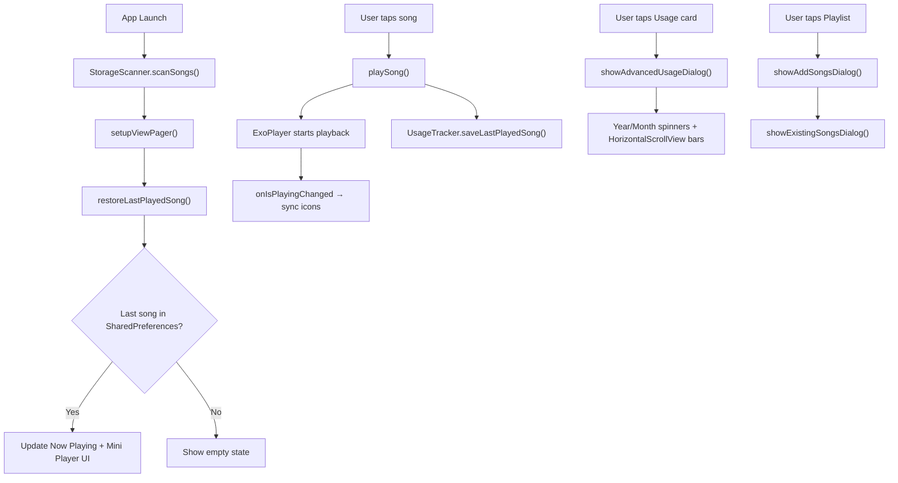

# 🎵 SonicWave — Project Walkthrough (v2.0.0)

## ✅ Build Status: **SUCCESSFUL** (34/34 tasks passed)

---

## Overview

SonicWave is a premium, offline-first music player for Android. Version 2.0.0 includes major upgrades to the dashboard, playback UX, playlist management, and state persistence.

---

## 🆕 v2.0.0 Changes

### 1. About — Version 2.0.0
The About dialog now shows **Version 2.0.0** with team credits.

**File:** `MainActivity.java` (showAboutDialog)

### 2. Dashboard — Advanced Usage Analytics
- **Weekly bar graph** on the Dashboard shows daily usage for the last 7 days
- **Tap to open Advanced Analytics dialog** with:
  - Year and Month filter spinners
  - Horizontally scrollable day-by-day bar chart (swipe left to see previous days)
  - Total usage and daily average summary
  - Today highlighted in accent color

**Files:** `HomeFragment.java`, `fragment_home.xml`, `UsageTracker.java`

### 3. Dashboard — Continue Listening (Last Played Only)
- **Before:** Showed random shuffled songs
- **Now:** Shows only the **last played song** with album art, title, artist, and a play button
- Song info persisted in SharedPreferences via `UsageTracker.saveLastPlayedSong()`

**Files:** `HomeFragment.java`, `fragment_home.xml`, `UsageTracker.java`

### 4. Now Playing — Clean UI
- **Removed:** The `320kbps, 44.1 Hz, MPEG` extra info line and the Format Badge (MP3/FLAC)
- **Kept:** Genre tag chip, album art, song title, artist
- **Seekbar improved:** Uses `isUserSeeking` flag — seek fires only on `ACTION_UP` (finger lift), preventing jumpy scrubbing during drag

**Files:** `CurrentSongFragment.java`, `fragment_current_song.xml`

### 5. Play/Pause Button Logic
- **Play/Pause icon** now stays in sync at all times via:
  - The seekbar updater (runs every 200ms) checks and updates the icon
  - ExoPlayer's `onIsPlayingChanged` listener triggers UI updates on both mini player and Now Playing
- **Guarantee:** Playing → shows **Pause icon** only. Paused → shows **Play icon** only.

**Files:** `CurrentSongFragment.java`, `MainActivity.java`

### 6. State Restoration on App Reopen
- When a song is played, its info is saved to SharedPreferences
- On cold start after songs load, `restoreLastPlayedSong()` finds the song in the library and:
  - Updates the Now Playing fragment UI
  - Updates the mini player (title, artist, album art)
  - Does NOT auto-play — just restores the visual state

**Files:** `MainActivity.java`, `UsageTracker.java`

### 7. Playlist Management — Full Overhaul
On clicking **any** playlist (empty or not):
1. **Add Songs dialog** opens with:
   - A **search field** to filter songs by title/artist
   - **Multi-select checkboxes** for all device songs (excluding ones already in the playlist)
   - "Add Selected" button → adds checked songs
2. After adding (or on Cancel), **Existing Songs dialog** opens with:
   - All songs currently in the playlist with **checkboxes**
   - "Delete Selected" button → removes checked songs from the playlist
   - "Add More" button → reopens the song picker
   - "Close" button → dismisses

**Files:** `PlaylistFragment.java`

---

## Architecture Diagram

---

## Modified Files Summary

| File | Changes |
|------|---------|
| `MainActivity.java` | v2.0.0 About, restoreLastPlayedSong(), saveLastPlayedSong(), onIsPlayingChanged sync |
| `CurrentSongFragment.java` | Removed extra info/format badge, isUserSeeking flag, improved play/pause sync |
| `fragment_current_song.xml` | Removed tv_extra_info and tv_format_badge, seekbar height 40dp |
| `HomeFragment.java` | Last-played single card, advanced analytics dialog with filters |
| `fragment_home.xml` | Replaced rv_continue_list with single-song card, added no-last-song message |
| `UsageTracker.java` | Added last-played song persistence, getMonthlyUsage() for analytics |
| `PlaylistFragment.java` | Full rewrite: always-open song picker with search, existing songs management |
| `README.md` | Updated to reflect all v2.0.0 changes |

---

## Design Decisions

> [!NOTE]
> - **Seek on release only** — Prevents the seekbar from jumping during drag, matching YouTube Music behavior.
> - **No auto-play on restore** — Cold start shows the last song without playing it, avoiding unexpected audio.
> - **Dual-dialog playlist management** — Add → then Manage, giving users full control without losing context.
> - **SharedPreferences for last song** — Simple, fast, and sufficient for a single-song store.

> [!IMPORTANT]
> **IDE classpath warnings** (`not on classpath of project app`) are cosmetic. Do a **Gradle Sync** in Android Studio (File → Sync Project with Gradle Files) to resolve. Build passes successfully.
